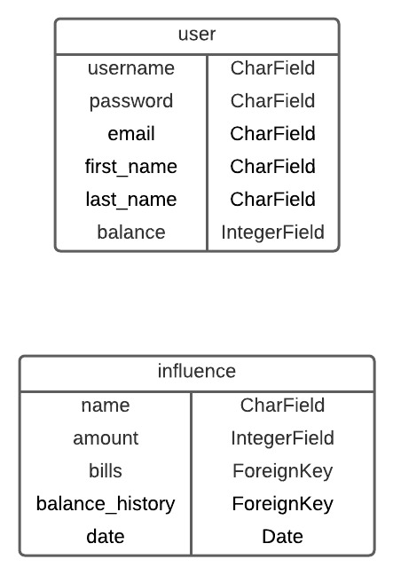
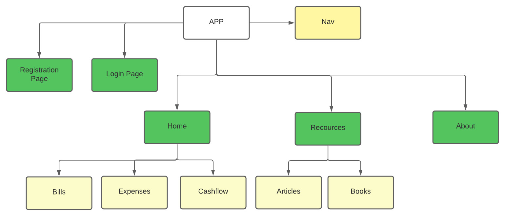
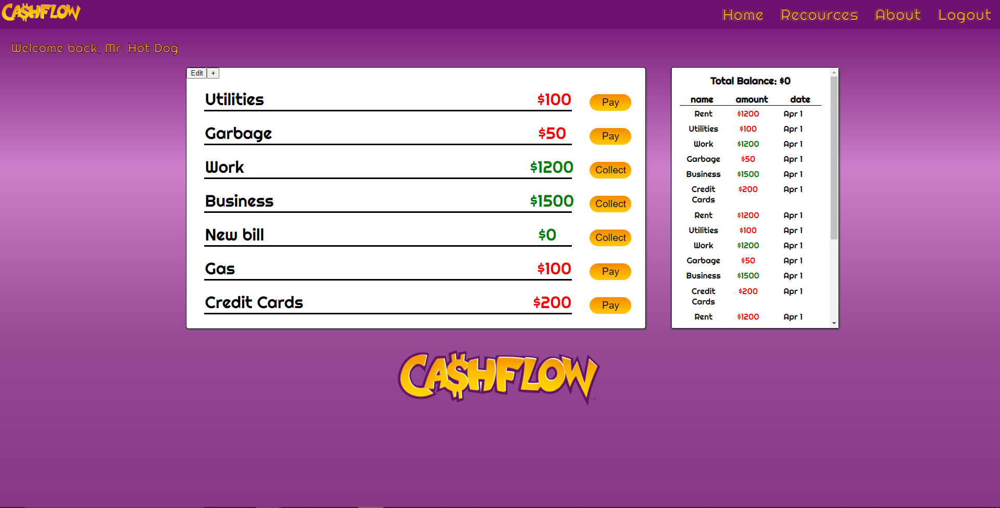
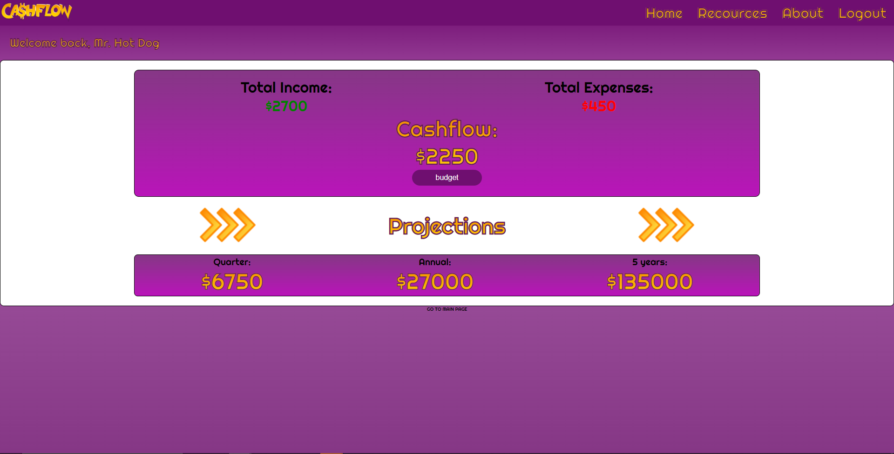
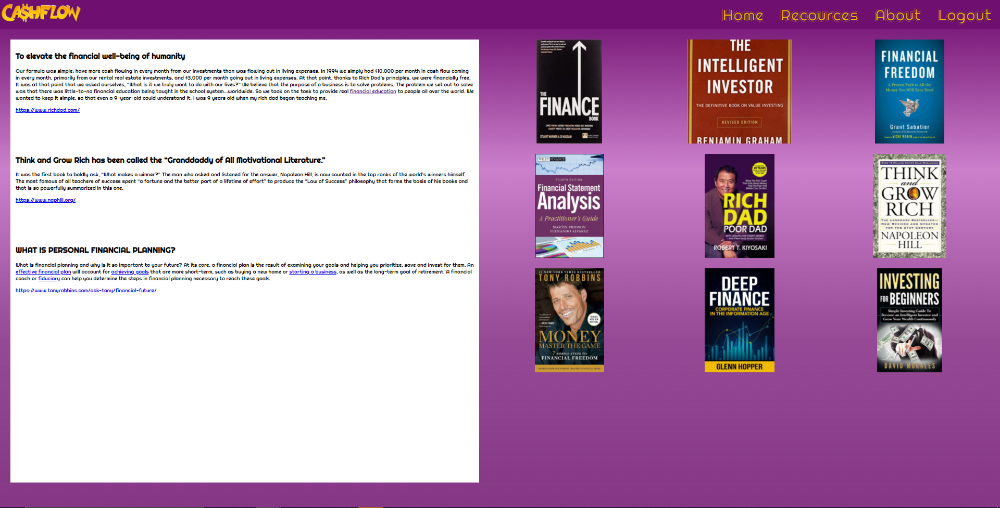

# CashFlow
### by Marvel Johnson and Vlad Kim
Date: Feb 4, 2022

## Introduction
____________

  

CashFlow is a web application that allows user to calculate their monthly financial surplus. It was built using Python3, Django, PostgreSQL, and Vue. Once logged in, users are prompted to add their monthly income and expenses. The app calculates monthly cash flow as well as future projections to encourage users’ to save money. The theme of this app came from Robert Kiyosaki’s best-seller “Rich Dad Poor Dad” book as well as “CashFlow board game”. This simplified version of the game UI tracks and records a history of users’ transactions. The back end was set up with full CRUD.

* Technologies
* Features
* ERD
* Component Hierarchy Diagram
* Screenshots

## Technologies
_____________

## Features
____
* Create account
* Create new bill or income source
* Collect income or paybills (Update user balance)
* Update and delete bills
* Resources page 
* Cashflow projections page

## Entity Relationship Diagram
_____

## Component Hierarchy Diagram

# Screenshots

### User UI

### Cashflow UI

### Resources Page

## Tools
____

Design: [Figma](https://www.figma.com/file/NrqKCiDZGDnoD6MxyVzyCL/Cashflow-Screen?node-id=0%3A1)

Organization: [Trello](https://trello.com/b/cC4oqQWh/u4hackathon)

# Conclusion

This project was a part of 1 day group hackathon for General Assembly Software Engineering Immersive Bootcamp.

# Contact info

Marvel Johnson [Github](https://github.com/MarvJohnson) 
[LinkedIn](https://www.linkedin.com/in/marvel-johnson/)

Vladimir Kim [Github](https://github.com/vladkim91)
[LinkedIn](https://www.linkedin.com/in/vladimir-akim/)